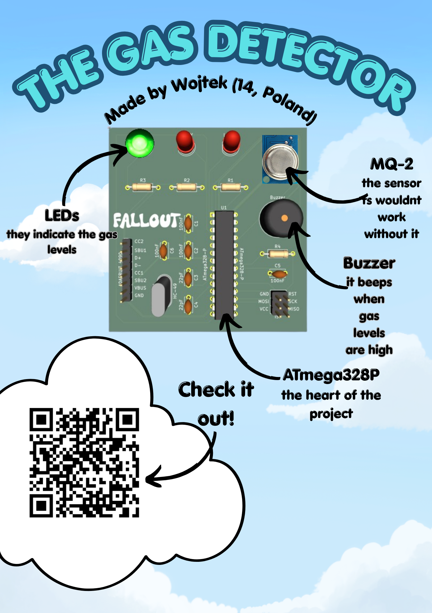

# MQ-2 Gas Detector V1.0
It's my first custom PCB project created as part of the Hack Club Fallout.
It is designed to detect gas leaks and potential fire hazards.
This project also contains a case [Click here](3d_models/case)

I made this because I wanted to practice making PCBs and create a practical safety device.
I use it by letting it sit and monitor gas levels in my room to ensure I'm in a safe environment.

## How it works:
The heart of this project is ATmega328P microcontroller. The board is powered via 5V USB-C (Adafruit 4090). The firmware features pre-heating phase (5mins) and a startup test function which lights up the LEDs and beeps the buzzer so you can know if it works correctly. It monitors gas levels in the air using an MQ-2 sensor and indicates safety levels by 3 LEDs and a buzzer:
- 🟢 Air is safe.
- 🟡 Gas levels are elevated. (warning)
- 🔴 High gas levels, it may be unsafe to inhale them.
<small> Thresholds were calibrated based on local home testing, sensitivity can vary depending on environment and gas type. </small>

### Shopping list 🛒: 
<small> BOM is available [here](Manufacturing/BOM.csv) </small>
- ATmega328P microcontroller
- MQ-2 gas sensor
- Adafruit USB Type C Breakout Board - Downstream Connection (ID:4090)
- Resistors (3x 220Ω, 1x 10KΩ)
- Ceramic capacitors (4x 100nF, 2x 22pF)
- LEDs (1x 5mm red LED, 1x 5mm yellow LED, 1x 5mm green LED)
- HC-49 Crystal 16MHz
- 2x3 Male Header (for ISP programming interface)
- 1x4 Female Header (for the MQ-2 sensor)
- 1x8 Male header (for Adafruit 4090)
- 12x9.5mm Active Buzzer (RM.7.5)
- basic soldering kit (iron, solder, wire cutters)
- PCB (can order on websites like JLCPCB, files for them are in Manufacturing Files.zip folder)
- USBasp
- Double Sided Tape
- DuPont Male/Female wires
- Glue (for the case, it needs to stick to plastic)
- wire cutters

Total for everything is ≈ 32.76USD

### Manufacturing Notes🏭:
<small> All files required for production are included [here](Manufacturing/Manufacturing%20Files.zip) </small>
- PCB Color: Black
- Silkscreen: White
- Copper Layers: 2

## 📖 Fallout Zine Page

# Assembly and firmware
Refer to the schematic and PCB layout for assembly. The PCB features a well detailed silkscreen with all components values and identifiers clearly marked to ensure easy and error-free assembly. The firmware is available [here](firmware/gas_detector.ino)
# Gallery📷
**CASE**

**PCB**

